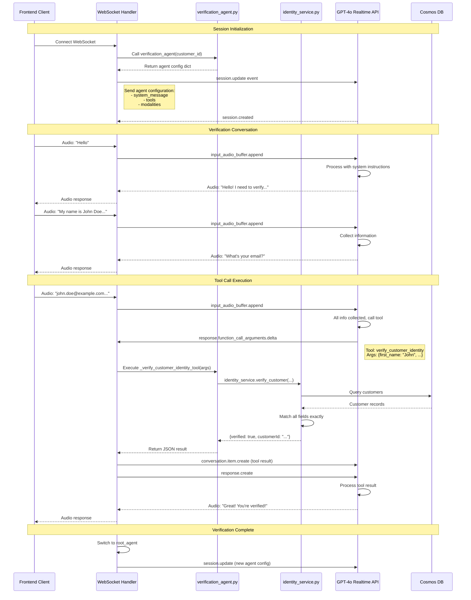
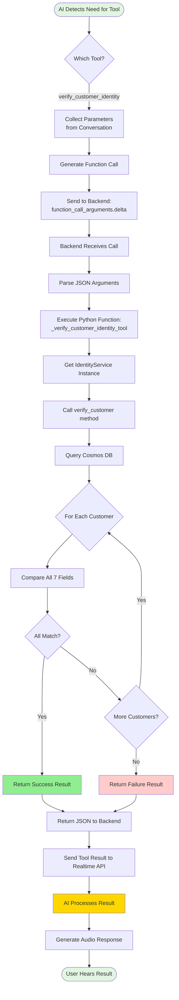
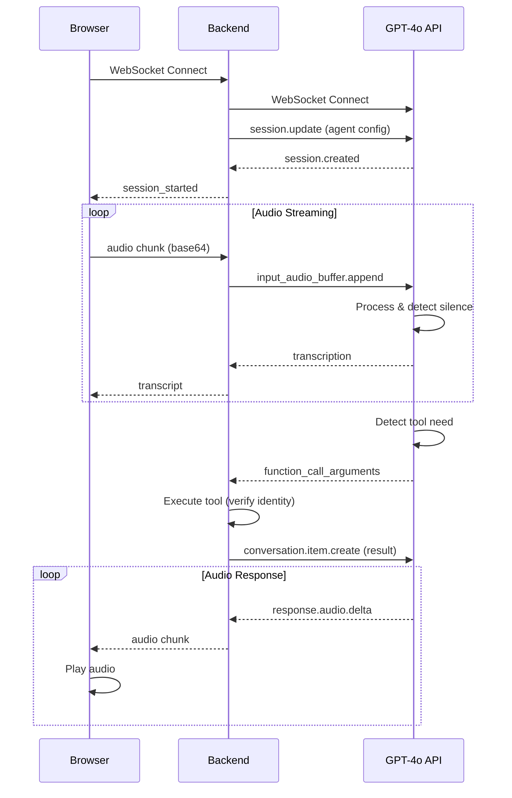
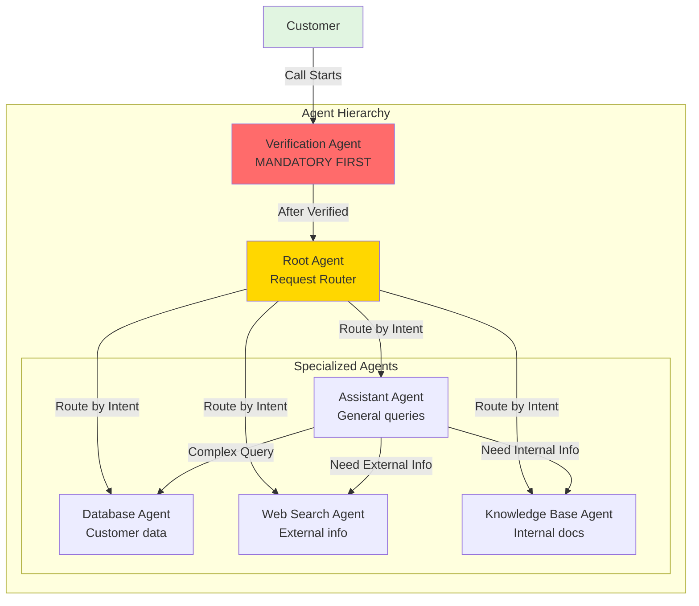
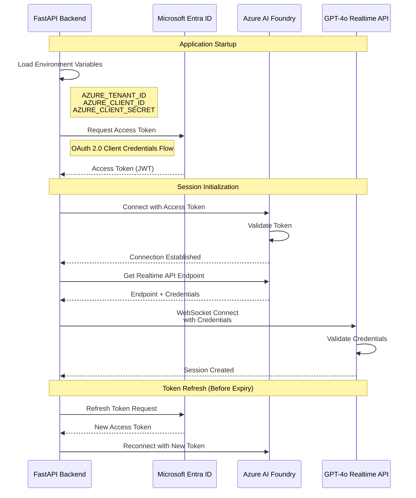
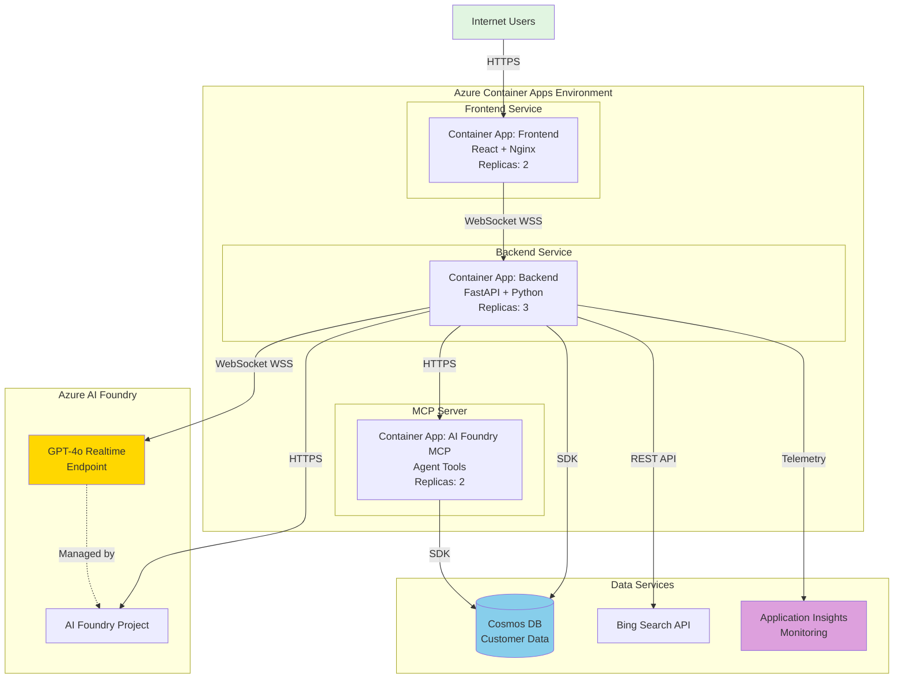

# Helsana Realtime Voice Call Center - System Architecture

## Table of Contents
1. [System Overview](#system-overview)
2. [GPT-4o Realtime API](#gpt-4o-realtime-api)
3. [WebSocket Communication](#websocket-communication)
4. [Verification Agent Architecture](#verification-agent-architecture)
5. [Audio Stream Processing](#audio-stream-processing)

---

## System Overview

The Helsana Realtime Voice Call Center is an AI-powered customer service system enabling natural voice conversations between customers and AI agents.

### Technology Stack
- **Azure AI Foundry** - AI orchestration platform
- **GPT-4o Realtime API** - Low-latency voice-to-voice model
- **WebSocket Protocol** - Bidirectional real-time communication
- **FastAPI Backend** - Python-based API server
- **React Frontend** - Web interface
- **Cosmos DB** - Customer data storage

### Key Features
- Real-time voice conversations with <1 second latency
- Mandatory identity verification before service access
- Multi-agent system with specialized capabilities
- Audio streaming with PCM16 24kHz format
- Tool calling for dynamic functionality  

---

## GPT-4o Realtime API

### Overview

**GPT-4o Realtime** is OpenAI's model designed for **low-latency voice interactions**. Unlike traditional text-based models that require separate speech-to-text and text-to-speech steps, GPT-4o Realtime processes audio **natively**.

### Key Characteristics

| Feature | Description |
|---------|-------------|
| **Native Audio** | Processes audio directly without transcription |
| **Low Latency** | <1 second response time |
| **Bidirectional** | Handles simultaneous input/output streams |
| **Function Calling** | Supports tool/function calls during conversation |
| **Audio Format** | PCM16 24kHz mono |
| **Protocol** | WebSocket (not HTTP REST) |
| **API Version** | 2024-10-01-preview |

### WebSocket Events

The Realtime API communicates via WebSocket events:

**Client to Server (Backend to Azure):**
```json
// 1. Session configuration
{
  "type": "session.update",
  "session": {
    "modalities": ["text", "audio"],
    "instructions": "You are a verification agent...",
    "voice": "alloy",
    "input_audio_format": "pcm16",
    "output_audio_format": "pcm16",
    "turn_detection": {
      "type": "server_vad",
      "threshold": 0.5,
      "silence_duration_ms": 500
    },
    "tools": [...]
  }
}

// 2. Audio chunk
{
  "type": "input_audio_buffer.append",
  "audio": "base64_encoded_pcm16_audio"
}

// 3. Tool result
{
  "type": "conversation.item.create",
  "item": {
    "type": "function_call_output",
    "call_id": "call_abc123",
    "output": "{\"status\": \"verified\"}"
  }
}
```

**Server to Client (Azure to Backend):**
```json
// 1. Audio transcription
{
  "type": "conversation.item.input_audio_transcription.completed",
  "transcript": "Hello, I need to verify my identity"
}

// 2. Function call
{
  "type": "response.function_call_arguments.delta",
  "call_id": "call_abc123",
  "name": "verify_customer_identity",
  "arguments": "{\"first_name\": \"John\"}"
}

// 3. Audio response
{
  "type": "response.audio.delta",
  "delta": "base64_encoded_audio_chunk"
}
```

---

## WebSocket Communication

## Verification Agent Architecture

### Purpose and Design

The **Verification Agent** is the **mandatory first step** in every customer interaction. It ensures that only authenticated customers can access services by verifying their identity through personal information matching.

### Agent Configuration Structure

```python
# verification_agent.py

def verification_agent(customer_id: str) -> Dict[str, Any]:
    """
    Returns agent configuration for Azure AI Foundry.
    
    This configuration is sent to GPT-4o Realtime API to define:
    1. Agent behavior (system instructions)
    2. Available tools (functions the agent can call)
    3. Agent metadata (name, description, ID)
    """
    
    # System instructions - defines agent behavior
    instructions = [
        "🔐 You are the Identity Verification Agent.",
        "IMPORTANT: The customer MUST verify their identity before accessing any services.",
        "VERIFICATION PROCESS:",
        "1. Greet the customer warmly",
        "2. Explain that identity verification is required",
        "3. Request the following information:",
        "   - First Name",
        "   - Last Name",
        "   - Email Address",
        "   - Phone Number",
        "   - Street Address",
        "   - City",
        "   - Postal Code",
        "4. Call verify_customer_identity with the collected information",
        "5. If verification is NOT successful: Offer 2 more attempts",
        "6. If verification is SUCCESSFUL: Grant access immediately",
        "IMPORTANT RULES:",
        "- ALL fields must match EXACTLY (100% accuracy required)",
        "- Once verified, immediately grant access",
        f"CUSTOMER_ID for verification: {customer_id}",
        "Begin the verification process NOW."
    ]
    
    # Agent configuration
    return {
        "id": "Assistant_Verification",
        "name": "IdentityVerificationAgent",
        "description": "Verifies customer identity using personal information",
        "system_message": "\n".join(instructions),
        "tools": [
            {
                "name": "verify_customer_identity",
                "description": "Verifies customer identity. All fields must match EXACTLY.",
                "parameters": {
                    "type": "object",
                    "properties": {
                        "customer_id": {"type": "string"},
                        "first_name": {"type": "string"},
                        "last_name": {"type": "string"},
                        "email": {"type": "string"},
                        "phone_number": {"type": "string"},
                        "street": {"type": "string"},
                        "city": {"type": "string"},
                        "postal_code": {"type": "string"}
                    },
                    "required": ["customer_id"]
                },
                "returns": _verify_customer_identity_tool  # Python function
            }
        ]
    }
```

### How Agent Loads into Realtime API



### Tool Execution Flow



### Verification Logic Implementation

```python
# identity_service.py

class IdentityService:
    def verify_customer(
        self,
        first_name: str,
        last_name: str,
        email: str,
        phone_number: str,
        street: str,
        city: str,
        postal_code: str
    ) -> dict:
        """
        Verify customer identity with 100% exact matching.
        
        Matching Rules:
        - Text fields: Case-insensitive exact match
        - Phone: Normalized (remove spaces, dashes, parentheses)
        - All 7 fields must match for verification success
        
        Returns:
            {
                "verified": bool,
                "customerId": str | None,
                "confidence": float,
                "message": str,
                "details": dict
            }
        """
        try:
            # Get all customers from Cosmos DB
            customers = self._get_all_customers_from_cosmos()
            
            # Normalize phone number
            normalized_phone = self._normalize_phone(phone_number)
            
            # Iterate through customers
            for customer in customers:
                # Extract customer data
                c_first = customer.get("first_name", "").lower()
                c_last = customer.get("last_name", "").lower()
                c_email = customer.get("email", "").lower()
                c_phone = self._normalize_phone(customer.get("phone_number", ""))
                c_street = customer.get("address", {}).get("street", "").lower()
                c_city = customer.get("address", {}).get("city", "").lower()
                c_postal = customer.get("address", {}).get("postal_code", "")
                
                # Compare all fields
                if (c_first == first_name.lower() and
                    c_last == last_name.lower() and
                    c_email == email.lower() and
                    c_phone == normalized_phone and
                    c_street == street.lower() and
                    c_city == city.lower() and
                    c_postal == postal_code):
                    
                    # All fields match!
                    return {
                        "verified": True,
                        "customerId": customer.get("customer_id"),
                        "confidence": 1.0,
                        "message": "Customer successfully verified",
                        "details": {
                            "first_name": "match",
                            "last_name": "match",
                            "email": "match",
                            "phone_number": "match",
                            "street": "match",
                            "city": "match",
                            "postal_code": "match"
                        }
                    }
            
            # No match found
            return {
                "verified": False,
                "customerId": None,
                "confidence": 0.0,
                "message": "Verification failed - no matching customer found"
            }
            
        except Exception as e:
            logger.error(f"Verification error: {e}")
            raise
    
    def _normalize_phone(self, phone: str) -> str:
        """Remove spaces, dashes, parentheses from phone number."""
        return phone.replace(" ", "").replace("-", "").replace("(", "").replace(")", "")
    
    def _get_all_customers_from_cosmos(self) -> list:
        """Query all customers from Cosmos DB."""
        container = self.cosmos_client.get_database_client("helsana-db")\
                                      .get_container_client("Customer")
        
        query = "SELECT * FROM c"
        return list(container.query_items(query, enable_cross_partition_query=True))
```

---

### Complete Communication Flow



### Backend WebSocket Handler

```python
# realtime_handler.py

class RealtimeWebSocketHandler:
    """Handles WebSocket connections for realtime voice interactions."""
    
    async def connect(self):
        """Accept WebSocket and initialize session."""
        await self.websocket.accept()
        
        # Initialize Azure AI Foundry client
        project_client = AIProjectClient.from_connection_string(
            conn_str=os.environ["AI_FOUNDRY_PROJECT_CONNECTION_STRING"]
        )
        
        # Connect to Realtime API
        self.realtime_client = await project_client.realtime.connect()
        
        # Load verification agent
        await self.load_agent("verification")
    
    async def load_agent(self, agent_type: str):
        """Load agent configuration into Realtime API."""
        agent_config = verification_agent(customer_id=self.session_id)
        
        # Send session.update to Realtime API
        await self.realtime_client.send({
            "type": "session.update",
            "session": {
                "modalities": ["text", "audio"],
                "instructions": agent_config["system_message"],
                "voice": "alloy",
                "input_audio_format": "pcm16",
                "output_audio_format": "pcm16",
                "turn_detection": {
                    "type": "server_vad",
                    "threshold": 0.5,
                    "silence_duration_ms": 500
                },
                "tools": agent_config.get("tools", [])
            }
        })
    
    async def forward_client_to_realtime(self):
        """Forward messages from client to Realtime API."""
        while True:
            data = await self.websocket.receive_json()
            
            if data["type"] == "audio":
                audio_base64 = data["audio"]
                await self.realtime_client.send({
                    "type": "input_audio_buffer.append",
                    "audio": audio_base64
                })
    
    async def forward_realtime_to_client(self):
        """Forward messages from Realtime API to client."""
        while True:
            message = await self.realtime_client.receive()
            
            if message["type"] == "response.audio.delta":
                await self.websocket.send_json({
                    "type": "audio",
                    "audio": message["delta"]
                })
            
            elif message["type"] == "response.function_call_arguments.done":
                await self.handle_function_call(message)
    
    async def handle_function_call(self, message: dict):
        """Execute function call and return result."""
        function_name = message["name"]
        arguments = json.loads(message["arguments"])
        
        # Execute verification function
        result = _verify_customer_identity_tool(arguments)
        
        # Send result back
        await self.realtime_client.send({
            "type": "conversation.item.create",
            "item": {
                "type": "function_call_output",
                "call_id": message["call_id"],
                "output": result
            }
        })
```

---

## Audio Stream Processing

### Audio Format

**Configuration:**
- Sample Rate: 24000 Hz (24 kHz)
- Bit Depth: 16 bits per sample
- Channels: 1 (mono)
- Encoding: Linear PCM (PCM16)
- Chunk Size: ~100ms

**Frontend Capture:**
```javascript
const mediaRecorder = new MediaRecorder(stream, {
  mimeType: 'audio/webm;codecs=pcm',
  audioBitsPerSecond: 384000
});
```

**Backend Processing:**
```python
async def handle_audio(audio_base64: str):
    # Decode base64 to binary PCM16
    audio_bytes = base64.b64decode(audio_base64)
    # Forward to Realtime API
    await realtime_client.send_audio_chunk(audio_bytes)
```

### Latency Breakdown

| Stage | Latency | Notes |
|-------|---------|-------|
| Microphone to Browser | 0-10ms | Hardware buffer |
| Browser to Backend | 20-50ms | WebSocket |
| Backend to Azure | 10-30ms | Network |
| AI Processing | 200-400ms | Model inference |
| Azure to Backend | 10-30ms | Network |
| Backend to Browser | 20-50ms | WebSocket |
| Browser to Speaker | 0-10ms | Audio API |
| **Total** | **300-600ms** | Conversational |

---

## Component Details

### 1. Frontend Components

```typescript
// VoiceCallInterface.tsx

import { useEffect, useRef, useState } from 'react';

export function VoiceCallInterface() {
  const [isConnected, setIsConnected] = useState(false);
  const [isRecording, setIsRecording] = useState(false);
  const [transcript, setTranscript] = useState('');
  const [isVerified, setIsVerified] = useState(false);
  
  const wsRef = useRef<WebSocket | null>(null);
  const mediaRecorderRef = useRef<MediaRecorder | null>(null);
  const audioContextRef = useRef<AudioContext | null>(null);
  
  // Connect to WebSocket
  const connect = async () => {
    const ws = new WebSocket('ws://localhost:8000/ws/realtime');
    
    ws.onopen = () => {
      console.log('WebSocket connected');
      setIsConnected(true);
    };
    
    ws.onmessage = (event) => {
      const data = JSON.parse(event.data);
      handleMessage(data);
    };
    
    ws.onerror = (error) => {
      console.error('WebSocket error:', error);
    };
    
    ws.onclose = () => {
      console.log('WebSocket disconnected');
      setIsConnected(false);
    };
    
    wsRef.current = ws;
  };
  
  // Handle incoming messages
  const handleMessage = (data: any) => {
    switch (data.type) {
      case 'audio':
        playAudio(data.audio);
        break;
      case 'transcript':
        setTranscript(prev => prev + ' ' + data.text);
        break;
      case 'verification_complete':
        setIsVerified(true);
        break;
      case 'error':
        console.error('Error:', data.error);
        break;
    }
  };
  
  // Start recording
  const startRecording = async () => {
    const stream = await navigator.mediaDevices.getUserMedia({ audio: true });
    const mediaRecorder = new MediaRecorder(stream, {
      mimeType: 'audio/webm;codecs=pcm'
    });
    
    mediaRecorder.ondataavailable = (event) => {
      if (event.data.size > 0) {
        sendAudioChunk(event.data);
      }
    };
    
    mediaRecorder.start(100); // Chunk every 100ms
    mediaRecorderRef.current = mediaRecorder;
    setIsRecording(true);
  };
  
  // Send audio chunk
  const sendAudioChunk = async (blob: Blob) => {
    const arrayBuffer = await blob.arrayBuffer();
    const base64 = btoa(
      String.fromCharCode(...new Uint8Array(arrayBuffer))
    );
    
    if (wsRef.current?.readyState === WebSocket.OPEN) {
      wsRef.current.send(JSON.stringify({
        type: 'audio',
        audio: base64
      }));
    }
  };
  
  // Play audio
  const playAudio = (base64Audio: string) => {
    if (!audioContextRef.current) {
      audioContextRef.current = new AudioContext({ sampleRate: 24000 });
    }
    
    const audioData = atob(base64Audio);
    const arrayBuffer = new ArrayBuffer(audioData.length);
    const view = new Uint8Array(arrayBuffer);
    
    for (let i = 0; i < audioData.length; i++) {
      view[i] = audioData.charCodeAt(i);
    }
    
    audioContextRef.current.decodeAudioData(arrayBuffer, (buffer) => {
      const source = audioContextRef.current!.createBufferSource();
      source.buffer = buffer;
      source.connect(audioContextRef.current!.destination);
      source.start();
    });
  };
  
  return (
    <div className="voice-call-interface">
      <button onClick={connect} disabled={isConnected}>
        Connect
      </button>
      <button onClick={startRecording} disabled={!isConnected || isRecording}>
        Start Call
      </button>
      {isVerified && <div className="verified">✅ Verified</div>}
      <div className="transcript">{transcript}</div>
    </div>
  );
}
```

### 2. Multi-Agent System



---

## Data Flow Diagrams

### Complete End-to-End Flow

```mermaid
flowchart TD
    Start([Customer Initiates Call]) --> OpenBrowser[Open Web App]
    OpenBrowser --> ClickCall[Click 'Start Call' Button]
    ClickCall --> WSConnect[Establish WebSocket Connection]
    
    WSConnect --> BackendInit[Backend Initializes Session]
    BackendInit --> LoadVerif[Load Verification Agent Config]
    LoadVerif --> ConnectRealtime[Connect to Realtime API]
    ConnectRealtime --> SendConfig[Send Agent Config to Azure]
    SendConfig --> SessionReady[Session Ready]
    
    SessionReady --> StartMic[Start Microphone Capture]
    StartMic --> CaptureLoop{Capture Audio Loop}
    
    CaptureLoop --> Chunk[Capture 100ms Chunk]
    Chunk --> EncodeB64[Encode to Base64]
    EncodeB64 --> SendWS[Send via WebSocket]
    SendWS --> BackendRecv[Backend Receives]
    BackendRecv --> DecodeB64[Decode Base64]
    DecodeB64 --> ForwardRealtime[Forward to Realtime API]
    
    ForwardRealtime --> VAD{Voice Activity<br/>Detection}
    VAD -->|Silence 500ms| ProcessAudio[Process Audio Buffer]
    VAD -->|Still Speaking| CaptureLoop
    
    ProcessAudio --> Transcribe[Transcribe Speech]
    Transcribe --> Understand[Understand Intent]
    Understand --> CheckInfo{All Info<br/>Collected?}
    
    CheckInfo -->|No| AskMore[Generate Follow-up Question]
    CheckInfo -->|Yes| CallTool[Call verify_customer_identity]
    
    AskMore --> SynthesizeSpeech[Synthesize Speech]
    SynthesizeSpeech --> StreamAudio[Stream Audio Chunks]
    StreamAudio --> BackendForward[Backend Forwards]
    BackendForward --> ClientRecv[Client Receives]
    ClientRecv --> PlayAudio[Play Audio]
    PlayAudio --> CaptureLoop
    
    CallTool --> ToolExec[Execute Tool Function]
    ToolExec --> QueryDB[Query Cosmos DB]
    QueryDB --> MatchFields[Match All Fields]
    MatchFields --> VerifyResult{Verified?}
    
    VerifyResult -->|No| RetryCount{Attempts < 3?}
    RetryCount -->|Yes| AskAgain[Ask to Provide Info Again]
    RetryCount -->|No| TransferHuman[Transfer to Human Agent]
    AskAgain --> CaptureLoop
    
    VerifyResult -->|Yes| ReturnSuccess[Return Success to AI]
    ReturnSuccess --> AISuccess[AI Generates Success Message]
    AISuccess --> SynthSuccess[Synthesize Success Audio]
    SynthSuccess --> StreamSuccess[Stream Success Audio]
    StreamSuccess --> ClientSuccess[Client Plays Success]
    
    ClientSuccess --> SwitchAgent[Backend Switches to Root Agent]
    SwitchAgent --> LoadRoot[Load Root Agent Config]
    LoadRoot --> SendRoot[Send Root Config to Azure]
    SendRoot --> RootReady[Root Agent Ready]
    
    RootReady --> MainLoop{Main Conversation Loop}
    MainLoop --> UserSpeak[User Speaks]
    UserSpeak --> ProcessRequest[Process Request]
    ProcessRequest --> RouteAgent{Route to<br/>Which Agent?}
    
    RouteAgent -->|General| AssistantAgent[Assistant Agent]
    RouteAgent -->|Data Query| DatabaseAgent[Database Agent]
    RouteAgent -->|Web Info| WebSearchAgent[Web Search Agent]
    RouteAgent -->|Internal Docs| KBAgent[KB Agent]
    
    AssistantAgent --> ExecuteTask[Execute Task]
    DatabaseAgent --> ExecuteTask
    WebSearchAgent --> ExecuteTask
    KBAgent --> ExecuteTask
    
    ExecuteTask --> GenerateResp[Generate Response]
    GenerateResp --> SynthResp[Synthesize Audio]
    SynthResp --> StreamResp[Stream to Client]
    StreamResp --> PlayResp[Play Response]
    PlayResp --> MainLoop
    
    MainLoop -->|End Call| Disconnect[Disconnect WebSocket]
    TransferHuman --> Disconnect
    Disconnect --> Cleanup[Cleanup Resources]
    Cleanup --> End([Call Ended])
    
    style Start fill:#e1f5e1
    style VerifyResult fill:#ff6b6b
    style RootReady fill:#ffd700
    style End fill:#ffcccb
```



---

## Security & Authentication

### Azure Authentication Flow



### Data Security Measures

| Layer | Security Measure | Implementation |
|-------|-----------------|----------------|
| **Transport** | TLS 1.3 Encryption | WebSocket over WSS |
| **Authentication** | OAuth 2.0 + JWT | Azure Entra ID tokens |
| **Authorization** | RBAC | Azure AI Foundry access control |
| **Data at Rest** | Encryption | Cosmos DB encryption |
| **Data in Transit** | End-to-end encryption | WebSocket + Azure backbone |
| **PII Protection** | Data masking | Logs don't contain full PII |
| **Verification** | 100% exact match | Identity verification logic |
| **Retry Limits** | 3 attempts max | Prevents brute force |
| **Session Timeout** | 30 minutes | Automatic disconnect |
| **Audit Logging** | Application Insights | All operations logged |

### Environment Configuration

```bash
# .env file

# Azure Authentication
AZURE_TENANT_ID=<your-tenant-id>
AZURE_CLIENT_ID=<your-client-id>
AZURE_CLIENT_SECRET=<your-client-secret>
AZURE_SUBSCRIPTION_ID=<your-subscription-id>

# Azure AI Foundry
AI_FOUNDRY_PROJECT_CONNECTION_STRING=<connection-string>
AZURE_OPENAI_ENDPOINT=https://<resource>.openai.azure.com/
AZURE_OPENAI_API_KEY=<api-key>
AZURE_OPENAI_DEPLOYMENT=gpt-4o-realtime-preview
AZURE_OPENAI_API_VERSION=2024-10-01-preview

# Cosmos DB
COSMOS_DB_ENDPOINT=https://<account>.documents.azure.com:443/
COSMOS_DB_KEY=<key>
COSMOS_DB_DATABASE=helsana-db
COSMOS_DB_CONTAINER=Customer

# Bing Search
BING_SEARCH_ENDPOINT=https://api.bing.microsoft.com/v7.0/search
BING_SEARCH_KEY=<key>

# Application
BACKEND_URL=https://ca-backend-xxx.azurecontainerapps.io
FRONTEND_URL=https://ca-frontend-xxx.azurecontainerapps.io
```

---

## Performance Metrics

### Latency Breakdown



```mermaid
gantt
    title Voice Call Latency Components
    dateFormat X
    axisFormat %L ms
    
    section Audio Capture
    Microphone Buffer    :0, 10
    Browser Processing   :10, 20
    WebSocket Send       :30, 50
    
    section Backend
    Receive & Decode     :50, 60
    Forward to Azure     :60, 80
    
    section Azure AI
    Network Transit      :80, 100
    Audio Processing     :100, 300
    AI Model Inference   :300, 600
    Response Generation  :600, 800
    Audio Synthesis      :800, 1000
    
    section Return Path
    Network Transit      :1000, 1020
    Backend Forward      :1020, 1040
    WebSocket Send       :1040, 1060
    
    section Client Playback
    Receive & Decode     :1060, 1070
    Audio Buffer         :1070, 1080
    Speaker Output       :1080, 1090
```

### Throughput Capacity

| Metric | Value | Notes |
|--------|-------|-------|
| **Concurrent Sessions** | 100+ | Per backend instance |
| **Audio Bitrate** | 384 kbps | PCM16 24kHz mono |
| **WebSocket Messages/sec** | 10-20 | Per session |
| **Database Queries/sec** | 50+ | Cosmos DB capacity |
| **End-to-End Latency** | 300-600ms | Typical voice interaction |
| **Session Duration** | 5-30 min | Average call length |

---

## Deployment Architecture



---

## Conclusion

This Helsana Realtime Voice Call Center system represents a **state-of-the-art implementation** of AI-powered customer service, combining:

### Key Achievements

✅ **Native Voice Processing** - GPT-4o Realtime API eliminates speech-to-text/text-to-speech overhead  
✅ **Low Latency** - Sub-second response times for natural conversations  
✅ **Mandatory Verification** - Security-first design with 100% exact matching  
✅ **Multi-Agent Architecture** - Specialized agents for different tasks  
✅ **Scalable Infrastructure** - Azure Container Apps with auto-scaling  
✅ **Real-time Communication** - WebSocket-based bidirectional streaming  
✅ **Production-Ready** - Comprehensive error handling, logging, monitoring  

### Technology Stack Summary

| Layer | Technology |
|-------|-----------|
| **AI Model** | GPT-4o Realtime API |
| **AI Platform** | Azure AI Foundry |
| **Backend** | FastAPI (Python) |
| **Frontend** | React + TypeScript |
| **Database** | Azure Cosmos DB |
| **Hosting** | Azure Container Apps |
| **Monitoring** | Application Insights |
| **Protocol** | WebSocket (WSS) |
| **Audio Format** | PCM16 24kHz |

### Future Enhancements

🔮 **Multi-language support** - Extend to German, French, Italian  
🔮 **Sentiment analysis** - Real-time emotion detection  
🔮 **Call analytics** - Conversation insights and metrics  
🔮 **Advanced routing** - AI-powered intent classification  
🔮 **Integration** - CRM and ticketing system connections  
🔮 **Mobile apps** - Native iOS/Android applications  

This architecture provides a **solid foundation** for building sophisticated AI voice agents that can scale to handle thousands of concurrent conversations while maintaining high quality and security standards.
