# Identity Verification Agent System - Detailed Architecture

## System Architecture Overview

This identity verification agent system is built on the **Azure AI Foundry Agent Framework** and enforces mandatory identity verification before customers can access services. The system uses a multi-layered architecture design, including agent layer, service layer, routing layer, and data layer.

## Core Files and Their Responsibilities

### 1. **Agent Layer**

#### `/src/backend/agents/verification_agent.py` ⭐ Core File
**Responsibility:** Define the configuration and tools for the mandatory identity verification agent

**Key Components:**
- **`verification_agent(customer_id)` Function**
  - Returns an agent configuration dictionary
  - Contains system instructions (system_message) - tells the AI agent how to behave
  - Defines available tools - functions the agent can call
  - This is the standard configuration format for Azure AI Foundry agents

- **`_verify_customer_identity_tool(params)` Function**
  - The actual tool function that performs identity verification
  - Calls the IdentityService for verification
  - Returns verification results in JSON format

- **`_get_security_questions_tool(params)` Function**
  - Tool function to retrieve security questions
  - Called after successful identity verification

- **`_verify_security_answers_tool(params)` Function**
  - Tool function to verify security question answers
  - Completes the two-factor authentication

**Azure Agent Framework Usage:**
```python
{
    "id": "Assistant_Verification",           # Unique agent identifier
    "name": "IdentityVerificationAgent",      # Agent name
    "description": "...",                     # Agent description
    "system_message": "...",                  # System prompt (agent behavior instructions)
    "tools": [                                # List of available tools
        {
            "name": "verify_customer_identity",
            "description": "...",
            "parameters": {...},               # Parameter definition in JSON Schema format
            "returns": _verify_customer_identity_tool  # Actual Python function to execute
        }
    ]
}
```

#### `/src/backend/agents/identity_agent.py` 
**Responsibility:** Optional identity verification agent (non-mandatory)

- Provides similar verification functionality
- Can be called at any time during conversation
- Uses the same underlying services

### 2. **Service Layer**

#### `/src/backend/services/identity_service.py` ⭐ Core Service
**Responsibility:** Implements the business logic for identity verification

**Key Classes and Methods:**

```python
class IdentityService:
    def __init__(self, cosmos_client=None):
        """Initialize service and connect to Cosmos DB"""
        
    def verify_customer(
        self,
        first_name, last_name, email, phone_number,
        street, city, postal_code
    ):
        """
        Core verification method
        
        Verification Logic:
        1. Retrieve all customers from Cosmos DB
        2. Iterate through each customer
        3. Exact match each provided field with database fields
        4. Text fields are case-insensitive
        5. Phone numbers are normalized (remove spaces, dashes, parentheses)
        6. ALL provided fields must match 100%
        7. Return verification result
        """
        
    def get_security_questions(self, customer_id, count=2):
        """Retrieve security questions for a customer"""
        
    def verify_security_answers(self, customer_id, answers):
        """Verify security question answers"""
```

**Data Matching Rules:**
- **first_name**: Case-insensitive, exact match
- **last_name**: Case-insensitive, exact match
- **email**: Case-insensitive, exact match
- **phone_number**: Exact match after normalization (+12065551234 equals 206-555-1234)
- **street**: Case-insensitive, exact match
- **city**: Case-insensitive, exact match
- **postal_code**: Exact match

### 3. **Route Layer**

#### `/src/backend/routes/identity.py`
**Responsibility:** Provide REST API endpoints for external access

**Key Endpoints:**
```python
@router.post("/identity/verifyCustomer")
async def verify_customer(request: VerifyCustomerRequest):
    """
    HTTP API endpoint
    Receives verification request, calls IdentityService, returns result
    """
```

**Data Models:**
- `VerifyCustomerRequest` - Request model (defines accepted parameters)
- `VerifyCustomerResponse` - Response model (defines returned data structure)

### 4. **WebSocket Layer**

#### `/src/backend/websocket/realtime_handler.py`
**Responsibility:** Handle WebSocket connections for real-time voice calls

- Receives WebSocket connections from frontend
- Communicates with Azure AI Foundry Realtime API
- Enforces verification_agent call at session start
- Manages agent state and tool calls

### 5. **Data Layer**

#### Cosmos DB
**Container:** Customer

**Data Structure:**
```json
{
    "customer_id": "f487e18c016031ce9ab99ce22715fd82",
    "first_name": "Wendy",
    "last_name": "Taylor",
    "email": "wendy.taylor@example.com",
    "phone_number": "+12065551234",
    "address": {
        "street": "Maple Avenue 45",
        "city": "Seattle",
        "postal_code": "98109",
        "country": "USA"
    },
    "identity_verification": {
        "versicherungsnummer": "...",  // Optional field
        "geburtstag": "...",           // Optional field
        "adresse": "...",              // Optional field
        "security_questions": [...]
    }
}
```

## Azure AI Foundry Agent Framework Usage

### 1. **Agent Definition**

Azure AI Foundry uses declarative configuration to define agents:

```python
agent_config = {
    "id": "unique_identifier",
    "name": "agent_name",
    "description": "agent_functionality_description",
    "system_message": """
        This is the system prompt for the AI model
        Defines the agent's role, responsibilities, and behavior rules
        Tells the AI how to interact with users
        When to call which tools
    """,
    "tools": [...]  # List of tools
}
```

### 2. **Tool Definition**

Each tool follows the OpenAI Function Calling specification:

```python
{
    "name": "tool_name",
    "description": "tool_functionality_description (AI uses this to decide when to call)",
    "parameters": {
        "type": "object",
        "properties": {
            "parameter_name": {
                "type": "string/number/boolean/array/object",
                "description": "parameter_description"
            }
        },
        "required": ["list_of_required_parameters"]
    },
    "returns": actual_python_function  # Executed when AI decides to call
}
```

### 3. **Execution Flow**

1. **User initiates voice call** → WebSocket connection established
2. **Backend initializes verification_agent** → Sends configuration to Azure AI Foundry
3. **Azure AI Foundry** receives system prompt and tool definitions
4. **AI model starts conversation** → Asks user for information based on system_message
5. **User provides information** → AI collects all required fields
6. **AI decides to call tool** → Generates `verify_customer_identity` function call
7. **Backend executes tool function** → `_verify_customer_identity_tool()` is called
8. **Tool returns result** → JSON string returned to AI
9. **AI processes result** → Reports verification result to user
10. **Verification successful** → Continues to security questions flow

### 4. **Tool Calling Mechanism**

Azure AI Foundry uses **Function Calling** mechanism:

```
User: "My name is Wendy Taylor"
  ↓
AI internal reasoning: "User provided name, I need to collect more information..."
  ↓
AI: "What's your email address?"
  ↓
User: "wendy.taylor@example.com"
  ↓
AI internal reasoning: "I now have enough information, should call verify_customer_identity tool"
  ↓
AI generates function call:
{
    "name": "verify_customer_identity",
    "arguments": {
        "first_name": "Wendy",
        "last_name": "Taylor",
        "email": "wendy.taylor@example.com",
        ...
    }
}
  ↓
Backend executes: _verify_customer_identity_tool(arguments)
  ↓
Returns result: {"status": "VERIFIED", "customerId": "..."}
  ↓
AI reads result: "Great! Your identity has been verified."
```

## Verification Logic Flow Diagram

```mermaid
flowchart TD
    Start([User Initiates Voice Call]) --> WS[Establish WebSocket Connection]
    WS --> Init[Initialize verification_agent]
    Init --> LoadAgent[Load Agent Config to Azure AI Foundry]
    
    LoadAgent --> SysMsg{System Prompt}
    SysMsg --> |Instructions| AIBehavior[AI Agent Behavior Rules:<br/>1. Greet user<br/>2. Explain verification needed<br/>3. Collect information]
    
    AIBehavior --> Greet[AI: Greet and explain verification process]
    Greet --> AskFirst[AI: Please provide your first name]
    
    AskFirst --> CollectInfo{Collect All Fields}
    CollectInfo --> |Ask| AskLast[AI: Please provide your last name]
    AskLast --> AskEmail[AI: Please provide your email]
    AskEmail --> AskPhone[AI: Please provide your phone number]
    AskPhone --> AskStreet[AI: Please provide your street address]
    AskStreet --> AskCity[AI: Please provide your city]
    AskCity --> AskPostal[AI: Please provide your postal code]
    
    AskPostal --> AllCollected{All Information<br/>Collected?}
    AllCollected --> |Yes| CallTool[AI Decides to Call<br/>verify_customer_identity Tool]
    AllCollected --> |No| CollectInfo
    
    CallTool --> ToolFunc[Execute _verify_customer_identity_tool]
    ToolFunc --> GetService[Get IdentityService Instance]
    GetService --> QueryDB[Query All Customers from Cosmos DB]
    
    QueryDB --> LoopCustomers{Iterate Each Customer}
    LoopCustomers --> CompareFields[Compare Provided Fields]
    
    CompareFields --> CheckFirst{first_name<br/>Match?}
    CheckFirst --> |No| NoMatch1[Mark as No Match]
    CheckFirst --> |Yes| CheckLast{last_name<br/>Match?}
    
    CheckLast --> |No| NoMatch2[Mark as No Match]
    CheckLast --> |Yes| CheckEmail{email<br/>Match?}
    
    CheckEmail --> |No| NoMatch3[Mark as No Match]
    CheckEmail --> |Yes| CheckPhone{phone_number<br/>Match?}
    
    CheckPhone --> |No| NoMatch4[Mark as No Match]
    CheckPhone --> |Yes| CheckStreet{street<br/>Match?}
    
    CheckStreet --> |No| NoMatch5[Mark as No Match]
    CheckStreet --> |Yes| CheckCity{city<br/>Match?}
    
    CheckCity --> |No| NoMatch6[Mark as No Match]
    CheckCity --> |Yes| CheckPostalCode{postal_code<br/>Match?}
    
    CheckPostalCode --> |No| NoMatch7[Mark as No Match]
    CheckPostalCode --> |Yes| AllMatch[All Fields Match!]
    
    NoMatch1 --> NextCustomer{More<br/>Customers?}
    NoMatch2 --> NextCustomer
    NoMatch3 --> NextCustomer
    NoMatch4 --> NextCustomer
    NoMatch5 --> NextCustomer
    NoMatch6 --> NextCustomer
    NoMatch7 --> NextCustomer
    
    NextCustomer --> |Yes| LoopCustomers
    NextCustomer --> |No| ReturnFailed[Return Verification Failed Result]
    
    AllMatch --> ReturnSuccess[Return Verification Success Result:<br/>customerId, confidence=1.0]
    
    ReturnSuccess --> AISuccess[AI Reads Success Result]
    ReturnFailed --> AIFailed[AI Reads Failed Result]
    
    AISuccess --> Announce[AI: Identity Verification Successful!]
    Announce --> GetQuestions[Call get_security_questions Tool]
    GetQuestions --> AskSecQ[AI: Please answer security question]
    AskSecQ --> VerifyAnswer[Call verify_security_answers Tool]
    VerifyAnswer --> Complete[Verification Complete, Grant Access]
    
    AIFailed --> RetryCount{Attempt Count<br/>< 3?}
    RetryCount --> |Yes| Retry[AI: Please provide information again]
    Retry --> CollectInfo
    RetryCount --> |No| Transfer[AI: Transfer to Human Agent]
    
    Complete --> End([User Can Access Services])
    Transfer --> End

    style Start fill:#e1f5e1
    style End fill:#ffe1e1
    style CallTool fill:#e1e5ff
    style ToolFunc fill:#e1e5ff
    style AllMatch fill:#90ee90
    style ReturnSuccess fill:#90ee90
    style ReturnFailed fill:#ffcccb
    style Complete fill:#90ee90
```



## File Interaction Diagram

```mermaid
flowchart LR
    User[User Voice Call] --> Frontend[Frontend WebSocket Client]
    Frontend --> WS[realtime_handler.py<br/>WebSocket Handler]
    
    WS --> AzureAI[Azure AI Foundry<br/>Realtime API]
    
    WS --> VA[verification_agent.py<br/>Agent Configuration]
    VA --> |System Message & Tools| AzureAI
    
    AzureAI --> |Tool Call Request| ToolExec[_verify_customer_identity_tool<br/>Tool Execution]
    
    ToolExec --> IS[identity_service.py<br/>IdentityService]
    IS --> |Query| DB[(Cosmos DB<br/>Customer Container)]
    DB --> |Customer Data| IS
    IS --> |Verification Result| ToolExec
    
    ToolExec --> |JSON Result| AzureAI
    AzureAI --> |AI Response| WS
    WS --> Frontend
    Frontend --> User
    
    API[REST API Client] --> Route[identity.py<br/>Route Handler]
    Route --> IS
    IS --> Route
    Route --> API

    style User fill:#e1f5e1
    style AzureAI fill:#ffd700
    style DB fill:#87ceeb
    style VA fill:#ffb6c1
    style IS fill:#dda0dd
```



## Key Design Patterns

### 1. **Strategy Pattern**
- Verification logic encapsulated in `IdentityService`
- Easy to switch between different verification strategies

### 2. **Tool Pattern**
- AI agent interacts with system through tools
- Tools are independent, testable functions
- Complies with OpenAI Function Calling specification

### 3. **Dependency Injection**
- `IdentityService` accepts `cosmos_client` parameter
- Facilitates testing and modularity

### 4. **Layered Architecture**
```
Presentation Layer (WebSocket) 
    ↓
Agent Layer (verification_agent.py)
    ↓
Service Layer (identity_service.py)
    ↓
Data Layer (Cosmos DB)
```

## Tool Calling Example

Here's a detailed example of how the AI agent calls a tool:

### Step 1: AI Collects Information
```
AI: "Hello! To verify your identity, I'll need some information."
User: "Sure"
AI: "What's your first name?"
User: "Wendy"
AI: "And your last name?"
User: "Taylor"
AI: "Your email address?"
User: "wendy.taylor@example.com"
... (continues collecting all fields)
```

### Step 2: AI Generates Tool Call
```json
{
    "tool_name": "verify_customer_identity",
    "arguments": {
        "customer_id": "session_id_12345",
        "first_name": "Wendy",
        "last_name": "Taylor",
        "email": "wendy.taylor@example.com",
        "phone_number": "+12065551234",
        "street": "Maple Avenue 45",
        "city": "Seattle",
        "postal_code": "98109"
    }
}
```

### Step 3: Backend Executes Tool Function
```python
# _verify_customer_identity_tool is called
def _verify_customer_identity_tool(params):
    # Get IdentityService
    identity_service = get_identity_service()
    
    # Call verification method
    result = identity_service.verify_customer(
        first_name=params.get("first_name"),
        last_name=params.get("last_name"),
        email=params.get("email"),
        phone_number=params.get("phone_number"),
        street=params.get("street"),
        city=params.get("city"),
        postal_code=params.get("postal_code")
    )
    
    # Return JSON result
    if result["verified"]:
        return json.dumps({
            "status": "VERIFIED",
            "customerId": result["customerId"],
            "confidence": 1.0,
            "message": "Identity successfully verified."
        })
```

### Step 4: IdentityService Performs Verification
```python
def verify_customer(self, first_name, last_name, email, ...):
    # Query all customers from Cosmos DB
    customers = self._get_all_customers_from_cosmos()
    
    # Iterate and match
    for customer in customers:
        if (customer["first_name"].lower() == first_name.lower() and
            customer["last_name"].lower() == last_name.lower() and
            customer["email"].lower() == email.lower() and
            # ... check all other fields
        ):
            # All fields match!
            return {
                "verified": True,
                "customerId": customer["customer_id"],
                "confidence": 1.0,
                "message": "Customer successfully verified"
            }
    
    # No match found
    return {
        "verified": False,
        "confidence": 0.0,
        "message": "Verification failed"
    }
```

### Step 5: AI Processes Result and Responds
```
AI reads: {"status": "VERIFIED", "customerId": "f487e18c..."}
AI: "Great! Your identity has been successfully verified. 
     Now I need to ask you a security question for additional authentication."
```

## Security Considerations

1. **100% Exact Match Requirement** - No partial or fuzzy matching allowed
2. **Multiple Attempt Limit** - Maximum 3 verification attempts
3. **Two-Factor Authentication** - Security questions required after identity verification
4. **Sensitive Data Protection** - Complete customer information not exposed during verification process
5. **Case-Insensitive Text Matching** - Reduces false negatives while maintaining security
6. **Phone Number Normalization** - Handles different phone number formats

## Scalability

The system design supports the following extensions:

1. **Add New Verification Fields** - Add parameters to `verify_customer()` method
2. **Multiple Authentication Methods** - Can add biometrics, OTP, etc.
3. **Custom Verification Rules** - Implement different matching logic in `IdentityService`
4. **Multi-Language Support** - Modify agent's `system_message` for different languages
5. **Different Agent Types** - Create specialized agents for different verification scenarios

## Error Handling

The system implements comprehensive error handling:

```python
# In tool functions
try:
    # Execute verification logic
    result = identity_service.verify_customer(...)
    return json.dumps({"status": "VERIFIED", ...})
except Exception as e:
    logger.error(f"Error: {e}")
    return json.dumps({
        "status": "ERROR",
        "message": f"An error occurred: {str(e)}"
    })
```

**Error Scenarios Handled:**
- Database connection failures
- Missing customer data
- Invalid input format
- Tool execution errors
- AI model errors

## Testing Strategy

### 1. **Unit Tests**
- Test `IdentityService.verify_customer()` with various inputs
- Test matching logic for each field
- Test phone number normalization

### 2. **Integration Tests**
- Test tool functions with mock IdentityService
- Test API endpoints with test database
- Test WebSocket connection handling

### 3. **End-to-End Tests**
- Test complete verification flow through voice interface
- Test retry mechanism
- Test security question flow

## Performance Optimization

### Database Query Optimization
```python
# Query all customers once, iterate in memory
customers = self._get_all_customers_from_cosmos()
for customer in customers:
    # Match logic
```

### Early Exit on Match
```python
# Stop searching once match found
if all_fields_match:
    best_match = customer
    break  # Early exit
```

### Phone Number Normalization
```python
# Normalize once before comparison
customer_phone = customer["phone_number"].replace(" ", "").replace("-", "")
provided_phone = phone_number.replace(" ", "").replace("-", "")
```

## Monitoring and Logging

The system implements comprehensive logging:

```python
logger.info(f"[IdentityService] Verifying customer: {first_name} {last_name}")
logger.info(f"[IdentityService] Checking {len(customers)} customers")
logger.info(f"[IdentityService] ✅ Customer verified: {customer_id}")
logger.warning(f"[IdentityService] ❌ Verification failed")
```

**Key Metrics to Monitor:**
- Verification success rate
- Average verification time
- Number of retry attempts
- Failed verification reasons
- Tool execution errors

## Conclusion

This identity verification agent system leverages Azure AI Foundry's powerful agent framework to create a secure, scalable, and maintainable authentication solution. The declarative tool definition pattern, combined with clean service layer separation, makes the system easy to understand, test, and extend.

The key strengths of this architecture are:

1. **Clear Separation of Concerns** - Each layer has a distinct responsibility
2. **Declarative Agent Configuration** - Easy to modify agent behavior
3. **Reusable Components** - IdentityService can be used by multiple agents
4. **Type-Safe Tool Definitions** - JSON Schema validation for parameters
5. **Comprehensive Error Handling** - Graceful degradation on failures
6. **Security-First Design** - 100% exact matching, retry limits, two-factor auth

This architecture can serve as a template for building other Azure AI Foundry agent-based systems.
